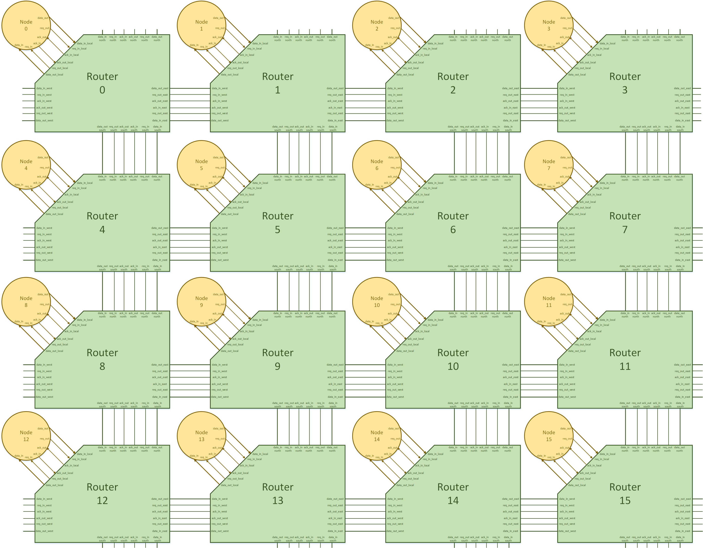
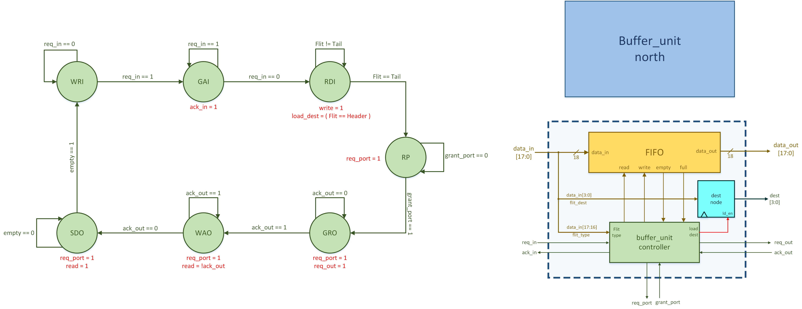
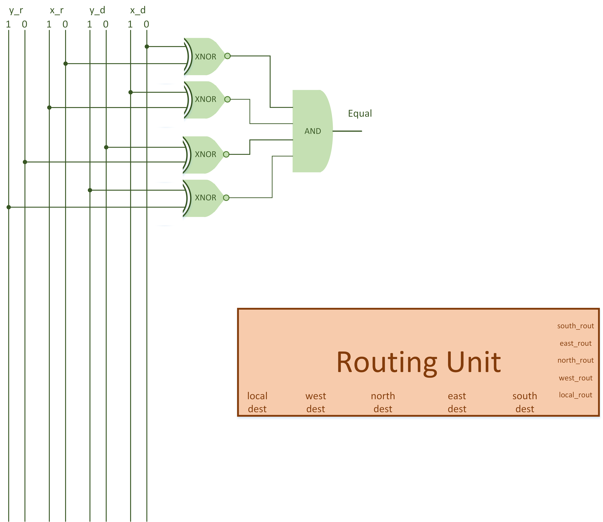
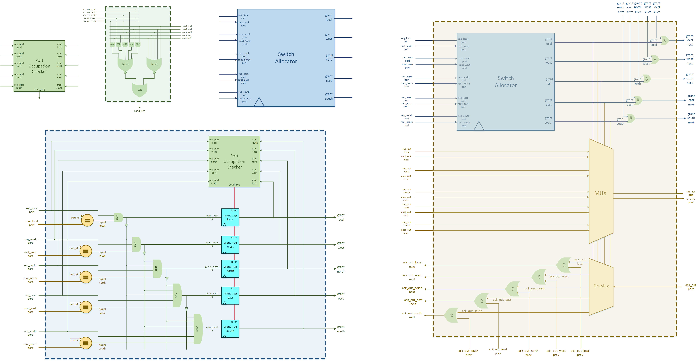
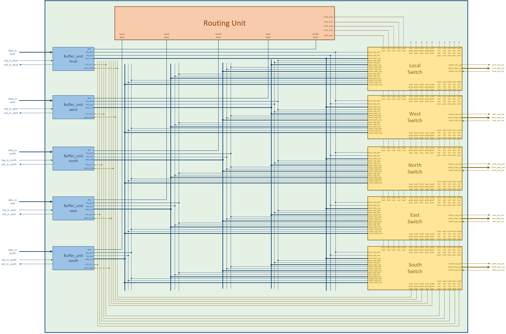

# 4x4 Mesh Grid Network on Chip (NoC) in Verilog

### Developed by Sadra Ghavami, University of Tehran

## Project Overview

This project implements a 4x4 Network on Chip (NoC) in Verilog, showcasing a modular and robust design for packet-based data transfer. The NoC comprises interconnected routers using a mesh topology and utilizes an efficient X-Y routing algorithm for data transmission. This README explains the design flow, key components, and test scenarios included in the project.

## Key Features

- **Mesh Grid Topology**: A 4x4 grid of routers, each with a local node for packet injection and reception.
- **X-Y Routing Algorithm**: Ensures efficient routing by first aligning nodes horizontally, then vertically to reach the destination.
- **Modular Components**: Including buffer units, routing units, switch allocators, and switch ports.
- **Detailed Documentation and Illustrations**: A comprehensive guide to the design flow, supported by vivid illustrations.

## Project Structure

The project files are organized as follows:

- **Verilog Code**: Contains all Verilog modules in subfolders, including testbenches for each component.
- **Illustrations**: High-quality illustrations providing a visual understanding of each design component.
- **Documentation**: A detailed report explaining each design component, the project flow, and verification scenarios.

## Design Flow

1. **Buffer Unit**: Each router includes five buffer units for local, west, north, east, and south directions. Packets consist of flits with a structured type and flow into a FIFO for temporary storage.

3. **Node Module**: Each router connects to a processing unit (node) responsible for generating packets and storing received data. Nodes can be configured with parameters for controlled packet generation.
4. **Routing and Switching**:
    - **Routing Unit**: Uses X-Y routing to determine the correct path for each packet based on destination coordinates.
   
    - **Switch Allocator**: Manages port access among buffer units based on priority.
    
5. **Router Module**: Integrates all units, forming a complete router capable of directing packets within the NoC.

6. **4x4 NoC Structure**: 16 routers arranged in a 4x4 grid, each connected both horizontally and vertically.

## Verification and Test Scenarios

Each design component has a corresponding Verilog testbench to verify functionality. The main verification scenarios include:

1. **Single Injection Verification**: Testing packet delivery to a single random destination.
2. **Multiple Packets per Node**: Each node generates multiple packets, testing for correct delivery order and timing.
3. **Full NoC Testing**: Tests packet delivery in complex scenarios, ensuring reliability and efficiency in routing.

## Getting Started

To get started with the project:

1. Clone the repository to your local machine.
2. Navigate to the Verilog Codes folder and open individual modules for modification or inspection.
3. Run testbenches to observe functionality in different scenarios.
4. Refer to the `Illustrations` folder for detailed visual explanations of each module and design aspect.

## Results

Test results are included for each component, illustrating the NoC’s packet delivery and routing reliability. Visuals in the documentation provide an in-depth view of each module’s performance under various scenarios.

---

